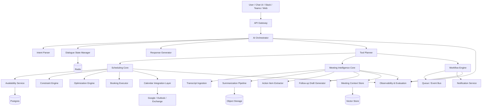
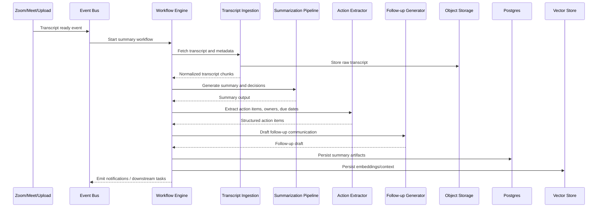
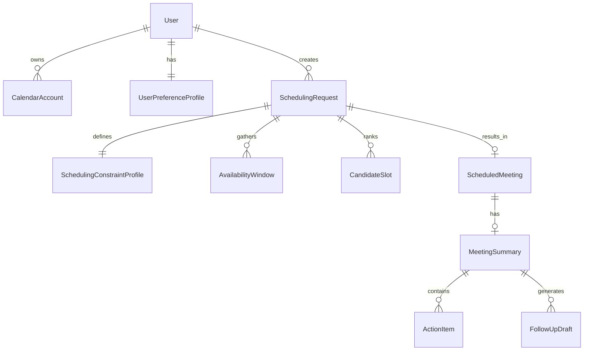
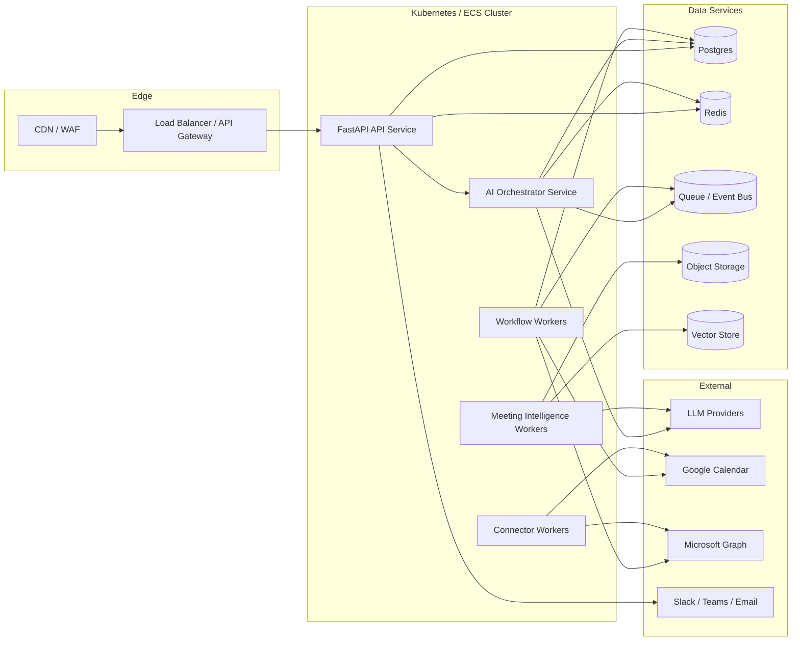

# SchedulrAI System Design Document

## 1. Overview

SchedulrAI is a hybrid AI scheduling and meeting intelligence platform that converts natural language requests into reliable, auditable calendar workflows. The system combines LLM-based language understanding with deterministic scheduling logic, optimization, and event-driven automation.

The design goal is to make the product feel intelligent while preserving the correctness guarantees expected from enterprise scheduling systems. To achieve that, the LLM is used for intent understanding, clarification, explanation, and content generation, while deterministic services handle availability computation, constraint enforcement, optimization, persistence, and execution.

## 2. Goals and Non-Goals

### 2.1 Goals

- Support conversational scheduling across chat, web, Slack, and Microsoft Teams.
- Parse ambiguous natural language into typed scheduling commands.
- Perform calendar-aware, timezone-safe, constraint-aware meeting recommendations.
- Execute booking, rescheduling, cancellation, and follow-up workflows safely.
- Generate meeting summaries, action items, and follow-up drafts from transcripts and notes.
- Provide strong observability, auditability, and evaluation for trust and debugging.
- Be extensible across calendar providers and messaging channels.

### 2.2 Non-Goals

- Replacing native calendar systems as the source of truth.
- Allowing an LLM to directly create or modify events without deterministic validation.
- Building a full video conferencing platform.
- Solving generalized enterprise workflow automation beyond scheduling and meeting intelligence.

## 3. Product Scope

SchedulrAI is composed of two closely related bounded domains:

1. **Scheduling Assistant**
   - Understands requests such as creating, changing, canceling, or suggesting meetings.
   - Fetches availability, scores candidate slots, and executes approved changes.

2. **Meeting Intelligence Assistant**
   - Ingests transcripts, notes, and metadata.
   - Produces summaries, decisions, action items, follow-up drafts, and meeting memory.

Both domains share identity, workflow orchestration, observability, persistence, and policy enforcement.

## 4. Functional Requirements

### 4.1 Scheduling Requirements

- Accept natural language requests such as:
  - “Schedule 30 minutes with Sarah next week afternoon.”
  - “Move tomorrow’s design review by an hour.”
  - “Find time with product and finance, but avoid Wednesday.”
- Extract and normalize:
  - participants
  - duration
  - date/time ranges
  - recurrence
  - preferences
  - priority
  - constraints
- Support provider-integrated free/busy lookup.
- Respect:
  - time zones
  - working hours
  - focus blocks
  - minimum notice
  - optional vs required attendees
  - buffers before and after meetings
  - recurring meeting rules
- Rank candidate slots with explanation metadata.
- Support create, update, cancel, and reschedule flows.
- Handle asynchronous lifecycle events such as accepted, declined, canceled, and moved invites.

### 4.2 Meeting Intelligence Requirements

- Ingest transcripts, notes, chat context, and linked meeting metadata.
- Produce structured outputs:
  - executive summary
  - decisions made
  - blockers
  - action items
  - owners
  - due dates
  - suggested follow-up communication
- Persist searchable historical meeting context.
- Support retrieval of recent meeting context during future interactions.

### 4.3 Platform Requirements

- Multi-tenant architecture with tenant isolation.
- Audit trail for every AI and execution step.
- Role-based permissions and policy checks for sensitive actions.
- Retries, idempotency, and compensation for async workflows.
- Evaluation harness for parsing, recommendation quality, and summarization.

## 5. Non-Functional Requirements

### 5.1 Reliability

- No duplicate bookings under retries.
- Provider outages should degrade gracefully.
- Workflows must be resumable and idempotent.

### 5.2 Performance

Interactive target latency:

- intent parsing: 200–600 ms
- availability fetch: 100–500 ms
- slot scoring: <100 ms for moderate candidate sets
- end-to-end assistant response: 1.5–2.5 seconds

### 5.3 Security and Compliance

- OAuth-based provider access with encrypted tokens.
- Encryption at rest and in transit.
- Fine-grained audit trail for scheduling actions.
- Policy enforcement before modifying external meetings.

### 5.4 Explainability

- Every recommended slot should include structured reason codes.
- Every execution should retain validation and policy decisions.
- Human-readable explanations should be generated from structured metadata.

### 5.5 Cost Efficiency

- Route simple extraction to smaller models.
- Escalate only ambiguous or high-value tasks to larger models.
- Cache availability, preferences, and common transformations.

## 6. Key Design Principles

### 6.1 Hybrid AI + Deterministic Execution

**LLM responsibilities**
- intent classification
- entity extraction
- clarification prompts
- result explanation
- meeting summary and follow-up generation

**Deterministic responsibilities**
- schema validation
- availability computation
- timezone conversion
- optimization and ranking
- booking execution
- retries, idempotency, and audit persistence

### 6.2 Provider Abstraction

Calendar and messaging integrations must be normalized behind provider-agnostic interfaces so the core scheduling logic remains decoupled from Google, Microsoft, Slack, Teams, or email-specific behaviors.

### 6.3 Event-Driven Orchestration

Scheduling and meeting intelligence both rely on asynchronous events such as webhook updates, transcript completion, invite responses, and reminder deadlines. Durable workflows are first-class citizens.

### 6.4 Explainable Recommendations

Recommendations must be explainable through reason codes like `works_for_all_attendees`, `preserves_focus_time`, and `outside_preferred_day_penalty` so the system remains debuggable and trustworthy.

## 7. High-Level Architecture



## 8. Major Components

### 8.1 Interaction Layer

**Responsibilities**
- User-facing channels: web app, chat UI, Slack bot, Teams bot.
- Session management and request metadata collection.
- Authentication and tenant routing.

**Key outputs**
- normalized user request envelope
- identity and tenant context
- locale and timezone
- selected integration context

### 8.2 API Gateway

**Responsibilities**
- request authentication and authorization
- rate limiting
- request tracing
- routing to synchronous APIs and event endpoints

### 8.3 AI Orchestrator

**Responsibilities**
- coordinate LLM parsing and deterministic tools
- manage stateful conversations
- route tasks to scheduling or meeting intelligence workflows
- convert system outcomes into natural language responses

**Subcomponents**
- intent parser
- entity extractor
- dialogue state manager
- tool planner
- response generator

### 8.4 Intent Parser

**Responsibilities**
- classify the user intent
- extract participants, duration, time window, constraints, priority
- estimate confidence
- raise clarification flags

**Representative intents**
- `create_meeting`
- `reschedule_meeting`
- `cancel_meeting`
- `find_time`
- `summarize_meeting`
- `generate_follow_up`
- `list_conflicts`
- `protect_focus_time`
- `batch_meetings`

**Structured output example**

```json
{
  "intent": "schedule_meeting",
  "participants": ["Sarah Chen"],
  "duration_minutes": 30,
  "time_range": {
    "relative_range": "next_week",
    "parts_of_day": ["afternoon"],
    "preferred_days": ["Tuesday", "Wednesday"]
  },
  "constraints": {
    "avoid_focus_blocks": true,
    "allow_reschedule": false
  },
  "priority": "normal",
  "confidence": 0.94,
  "needs_clarification": false
}
```

### 8.5 Dialogue State Manager

**Responsibilities**
- retain session-level scheduling context across turns
- store resolved and unresolved entities
- track selected recommendations and approval state

**Suggested storage split**
- Redis for short-lived conversational state
- Postgres for persistent task state and audit trail

### 8.6 Scheduling Core

#### Availability Service
- normalizes free/busy from connected providers
- merges work hours, focus blocks, OOO windows, and travel buffers
- converts all time computations into canonical UTC internally while preserving display timezone metadata

#### Constraint Engine
- applies hard and soft constraints
- evaluates slots using reusable rule objects
- emits rejection reasons and penalty details

Representative interface:

```python
class Constraint:
    def is_valid(self, slot, context) -> bool: ...
    def penalty(self, slot, context) -> float: ...
```

#### Optimization Engine
- scores valid slots using weighted deterministic ranking
- returns top-N options plus reason codes
- supports future evolution to OR-Tools or learned ranking models

Example scoring function:

```text
score =
  availability_score
  + preference_score
  + batching_bonus
  - timezone_penalty
  - overload_penalty
  - context_switch_penalty
```

#### Booking Executor
- creates, updates, and cancels calendar events
- applies policy checks and idempotency keys
- persists execution results and audit metadata

### 8.7 Calendar Integration Layer

**Responsibilities**
- fetch events and availability
- write meeting changes back to providers
- normalize provider schemas and webhook events

Representative abstraction:

```python
class CalendarProvider:
    def get_availability(self, request): ...
    def list_events(self, request): ...
    def create_event(self, request): ...
    def update_event(self, request): ...
    def cancel_event(self, request): ...
```

### 8.8 Meeting Intelligence Core

#### Transcript Ingestion
- accepts transcripts, notes, chat logs, and linked metadata
- stores raw artifacts in object storage
- normalizes speaker turns and timestamps

#### Summarization Pipeline
- cleans and chunks transcripts
- creates summaries and decisions
- extracts action items, owners, and due dates

#### Follow-up Draft Generator
- generates post-meeting emails, task drafts, or chat summaries
- conditions on audience, tone, and action item ownership

#### Meeting Context Store
- persists searchable summaries and embeddings for future retrieval

### 8.9 Workflow Automation Layer

**Responsibilities**
- durable orchestration of long-running tasks
- retries and compensating actions
- idempotent handling of webhooks and reminders

**Candidate technologies**
- Temporal
- AWS Step Functions
- queue + worker orchestration pattern

### 8.10 Platform Layer

- Postgres for transactional state
- Redis for cache and ephemeral conversation state
- object storage for transcripts and raw payloads
- vector store for semantic retrieval
- queue/event bus for async processing
- OpenTelemetry + metrics + logs + traces
- evaluation framework and offline datasets

## 9. Primary Request Lifecycle

### 9.1 Scheduling Request Flow

Example request: “Set up a 30-minute meeting with Sarah next week afternoon, preferably Tuesday or Wednesday, and avoid conflicts with my focus blocks.”

1. Interaction layer receives the request with user, tenant, timezone, and channel metadata.
2. AI orchestrator calls the intent parser for structured extraction.
3. Deterministic validator checks schema completeness, ambiguity, and policy.
4. Dialogue state is updated or a clarification path is triggered.
5. Scheduling core requests availability from connected calendar providers.
6. Constraint engine eliminates invalid slots and computes soft penalties.
7. Optimization engine ranks candidate slots and returns explanation metadata.
8. Booking executor either creates an event or returns ranked suggestions based on policy and user approval state.
9. Response generator converts structured outcomes into a natural language answer.
10. Audit trail stores the raw request, parsed intent, candidate slots, selected action, and execution outcome.

### 9.2 Scheduling Sequence Diagram

```mermaid
sequenceDiagram
    participant User
    participant UI as Chat/Web UI
    participant API as API Gateway
    participant ORCH as AI Orchestrator
    participant PARSE as Intent Parser
    participant STATE as Dialogue State
    participant VALID as Validator
    participant SCHED as Scheduling Core
    participant CAL as Calendar Connectors
    participant OPT as Optimization Engine
    participant EXEC as Booking Executor
    participant DB as Postgres

    User->>UI: Natural language scheduling request
    UI->>API: Authenticated request envelope
    API->>ORCH: Request + tenant + timezone context
    ORCH->>PARSE: Parse intent and entities
    PARSE-->>ORCH: Structured scheduling command
    ORCH->>VALID: Validate schema and ambiguity
    VALID-->>ORCH: Valid / clarification needed
    ORCH->>STATE: Persist turn state
    ORCH->>SCHED: Request recommendations
    SCHED->>CAL: Fetch free/busy + work hours + focus blocks
    CAL-->>SCHED: Normalized availability windows
    SCHED->>OPT: Score candidate slots
    OPT-->>SCHED: Ranked slots + reason codes
    SCHED-->>ORCH: Recommendations
    alt Auto-book allowed
        ORCH->>EXEC: Create event with idempotency key
        EXEC->>CAL: Create event
        CAL-->>EXEC: Provider confirmation
        EXEC->>DB: Persist execution and audit trail
        EXEC-->>ORCH: Booking result
    else Suggest only
        ORCH-->>UI: Ranked slot suggestions
    end
    ORCH->>DB: Persist request, parse, and outcome
    ORCH-->>UI: Natural language response
```

### 9.3 Meeting Intelligence Processing Flow

1. Transcript-ready event arrives from conferencing or upload pipeline.
2. Workflow engine starts the summary workflow.
3. Transcript ingestion stores raw artifacts and metadata.
4. Summarization pipeline generates summary, decisions, and action items.
5. Follow-up draft generator produces email or chat follow-up suggestions.
6. Structured artifacts are written to Postgres and embeddings to the vector store.
7. Notifications or downstream tasks are emitted.

### 9.4 Meeting Intelligence Sequence Diagram



## 10. Data Model

### 10.1 Core Entities

#### User
- `id`
- `tenant_id`
- `email`
- `display_name`
- `timezone`
- `role`
- `created_at`

#### CalendarAccount
- `id`
- `user_id`
- `provider`
- `provider_account_id`
- `scopes`
- `status`
- `token_ref`
- `webhook_cursor`

#### UserPreferenceProfile
- `id`
- `user_id`
- `work_hours`
- `preferred_days`
- `preferred_time_ranges`
- `focus_blocks`
- `max_meetings_per_day`
- `batching_preference`
- `minimum_notice_minutes`
- `default_meeting_duration`

#### SchedulingRequest
- `id`
- `tenant_id`
- `requester_user_id`
- `channel`
- `raw_message`
- `parsed_intent_json`
- `status`
- `needs_clarification`
- `idempotency_key`
- `created_at`

#### SchedulingConstraintProfile
- `id`
- `request_id`
- `hard_constraints_json`
- `soft_constraints_json`
- `policy_snapshot_json`

#### AvailabilityWindow
- `id`
- `request_id`
- `participant_id`
- `start_ts`
- `end_ts`
- `source`
- `window_type`

#### CandidateSlot
- `id`
- `request_id`
- `start_ts`
- `end_ts`
- `score`
- `rank`
- `reason_codes_json`
- `penalties_json`
- `selected`

#### ScheduledMeeting
- `id`
- `request_id`
- `provider_event_id`
- `organizer_user_id`
- `status`
- `start_ts`
- `end_ts`
- `meeting_url`
- `external_metadata_json`

#### WorkflowExecution
- `id`
- `workflow_type`
- `entity_type`
- `entity_id`
- `status`
- `attempt_count`
- `last_error`
- `started_at`
- `updated_at`

#### MeetingSummary
- `id`
- `scheduled_meeting_id`
- `summary_text`
- `decisions_json`
- `blockers_json`
- `raw_transcript_uri`
- `created_at`

#### ActionItem
- `id`
- `meeting_summary_id`
- `owner_user_id`
- `description`
- `due_date`
- `status`
- `source_span_ref`

#### FollowUpDraft
- `id`
- `meeting_summary_id`
- `channel`
- `subject`
- `body`
- `status`
- `generated_at`

### 10.2 Logical Relationships



## 11. API Design

### 11.1 External Synchronous APIs

#### `POST /v1/schedule/parse`
Parses a natural language request into structured scheduling intent.

Request:

```json
{
  "message": "Schedule 30 minutes with Sarah next week afternoon.",
  "channel": "web",
  "timezone": "America/New_York"
}
```

Response:

```json
{
  "intent": "create_meeting",
  "participants": ["Sarah Chen"],
  "duration_minutes": 30,
  "needs_clarification": false,
  "confidence": 0.94
}
```

#### `POST /v1/schedule/recommend`
Returns ranked candidate slots.

#### `POST /v1/schedule/book`
Books a selected slot.

#### `POST /v1/schedule/reschedule`
Reschedules an existing event.

#### `POST /v1/schedule/cancel`
Cancels an event subject to policy.

#### `POST /v1/meeting/summarize`
Triggers or executes summary generation.

#### `POST /v1/meeting/followup/generate`
Generates a follow-up draft from structured meeting artifacts.

### 11.2 External Event/Webhook APIs

- `POST /v1/webhooks/calendar/google`
- `POST /v1/webhooks/calendar/microsoft`
- `POST /v1/webhooks/invite-response`
- `POST /v1/webhooks/transcript-ready`

### 11.3 Internal Service APIs

- Availability service RPC/HTTP API
- Preferences service API
- Scoring service API
- Provider connector adapters
- Workflow event ingestion endpoint

### 11.4 API Design Considerations

- Use idempotency keys for booking and mutation endpoints.
- Return machine-readable reason codes in addition to user-facing strings.
- Support async job handles for expensive summary generation.
- Include trace IDs in response headers for debugging.

## 12. Workflow Design

### 12.1 Core Workflows

- `schedule_meeting_workflow`
- `reschedule_on_decline_workflow`
- `cancel_meeting_workflow`
- `meeting_summary_workflow`
- `post_meeting_followup_workflow`
- `recurring_schedule_optimization_workflow`

### 12.2 Workflow Requirements

- exactly-once logical execution through idempotency keys
- retriable external calls
- compensation for partial success
- durable timers for reminders and follow-ups
- audit logging across every state transition

## 13. Optimization Strategy

### 13.1 Candidate Generation

Generate candidate slots by intersecting:
- organizer availability
- attendee free/busy windows
- working hours
- focus block exclusions
- minimum notice windows
- recurrence constraints

### 13.2 Hard Constraints

Examples:
- attendee unavailable
- outside work hours
- overlapping protected focus block
- organizer lacks permission to move event

### 13.3 Soft Constraints

Examples:
- non-preferred day
- poor timezone fairness
- too many meetings in one afternoon
- poor batching efficiency
- excessive context switching

### 13.4 Ranking Outputs

Each candidate slot should emit:
- score
- rank
- penalty breakdown
- reason codes
- explanation metadata

## 14. Reliability, Safety, and Guardrails

### 14.1 Idempotency

Every mutation uses a deterministic idempotency key composed from tenant, requester, action type, and normalized scheduling intent so retries do not create duplicate events.

### 14.2 Validation Gates

Before any external write:
- schema validation
- participant resolution
- authorization and policy checks
- dry-run mode for risky changes
- explicit confirmation for sensitive actions

### 14.3 Audit Trail

Persist:
- original user input
- parsed intent
- model metadata and confidence
- constraints applied
- candidate slots scored
- final action taken
- provider response

### 14.4 Fallbacks

If parsing fails:
- fall back to rule-based extraction for simple patterns
- request clarification
- degrade to availability suggestions instead of direct action

## 15. Observability and Evaluation

### 15.1 Telemetry

Collect:
- request latency p50/p95/p99
- provider API latency and failure rate
- booking success rate
- retry counts and workflow failures
- cache hit ratio
- model cost per request
- parse confidence distributions

### 15.2 Evaluation Suites

#### Intent Parsing Evaluation
- intent accuracy
- entity extraction F1
- temporal normalization accuracy
- clarification precision/recall

#### Scheduling Quality Evaluation
- conflict-free booking rate
- preference satisfaction score
- focus-time preservation
- timezone fairness score
- back-and-forth reduction

#### Meeting Intelligence Evaluation
- summary completeness
- action item precision/recall
- owner extraction accuracy
- due date extraction accuracy

### 15.3 Trust and Debugging Tools

- replayable traces
- candidate slot inspection UI
- workflow event timeline
- parsed-intent vs final-execution comparison

## 16. Deployment Architecture

### 16.1 Runtime Topology



### 16.2 Recommended Stack

- **Backend:** Python, FastAPI, Pydantic
- **Database:** Postgres
- **Cache/Session State:** Redis
- **Workflow Engine:** Temporal or durable worker orchestration
- **Async Messaging:** SQS/SNS, Kafka, or managed event bus
- **Object Storage:** S3-compatible blob storage
- **Observability:** OpenTelemetry, Prometheus, Grafana, structured logging
- **Infrastructure:** Docker + Terraform or AWS CDK + Kubernetes/ECS

### 16.3 Scalability Strategy

- scale API, orchestrator, and worker pools independently
- shard high-volume webhook ingestion by provider and tenant
- cache read-heavy availability and preferences data
- use async processing for transcript-heavy tasks
- isolate provider connector workers to contain third-party instability

## 17. Security Architecture

- OAuth token storage via secret manager or encrypted token vault
- tenant-scoped authorization checks on every request
- signed webhook validation
- least-privilege provider scopes
- PII redaction in logs and analytics pipelines
- optional retention controls for transcripts and summaries

## 18. Risks and Mitigations

| Risk | Impact | Mitigation |
| --- | --- | --- |
| Ambiguous time expressions | Incorrect scheduling | clarification threshold, temporal validator, user confirmation |
| Provider API inconsistency | Failed or partial execution | provider abstraction, retries, reconciliation workflows |
| Duplicate writes on retries | Multiple bookings | idempotency keys and execution ledger |
| Hallucinated participant resolution | Wrong attendee invited | deterministic directory resolution and confidence gating |
| Poor ranking quality | User distrust | reason codes, evaluation suite, tunable scoring weights |
| Large transcript cost/latency | Slow summaries | chunking, async workflows, model routing |

## 19. Future Enhancements

- learned ranking model trained on accepted vs rejected suggestions
- policy-based recurring meeting optimization across teams
- travel-aware in-person scheduling support
- room/resource scheduling and equipment constraints
- CRM/task manager synchronization for action items
- administrator controls for org-wide focus-time and no-meeting policies

## 20. Suggested Repository Structure

```text
ai-scheduling-meeting-intelligence/
  apps/
    api/
    worker/
    ui/
  services/
    intent_parser/
    scheduling_core/
    optimization_engine/
    calendar_connectors/
    meeting_intelligence/
    workflow_engine/
  shared/
    schemas/
    utils/
    observability/
  evals/
    scheduling/
    summarization/
  infra/
    docker/
    terraform/
  docs/
    system-design.md
    api-spec.md
    eval-framework.md
```

## 21. Executive Summary

SchedulrAI should be implemented as a hybrid orchestration platform in which the LLM interprets human intent and generates explanations, while deterministic services ensure scheduling correctness, policy safety, optimization quality, and operational resilience. This architecture provides a strong foundation for both real-time scheduling automation and asynchronous meeting intelligence, and it scales well from a project portfolio demo to a production-grade enterprise assistant.
